# L.A.I.S.S. — LAPD Crime Data Analysis 2020–2024

End-to-end data science project analyzing 1 million+ crime incidents reported to the **Los Angeles Police Department (LAPD)** between January 2020 and December 2024. Ships as **L.A.I.S.S.** (Los Angeles Intelligence & Safety System), an interactive open-access web dashboard.

**Live:** https://lapd-data-crime.vercel.app/

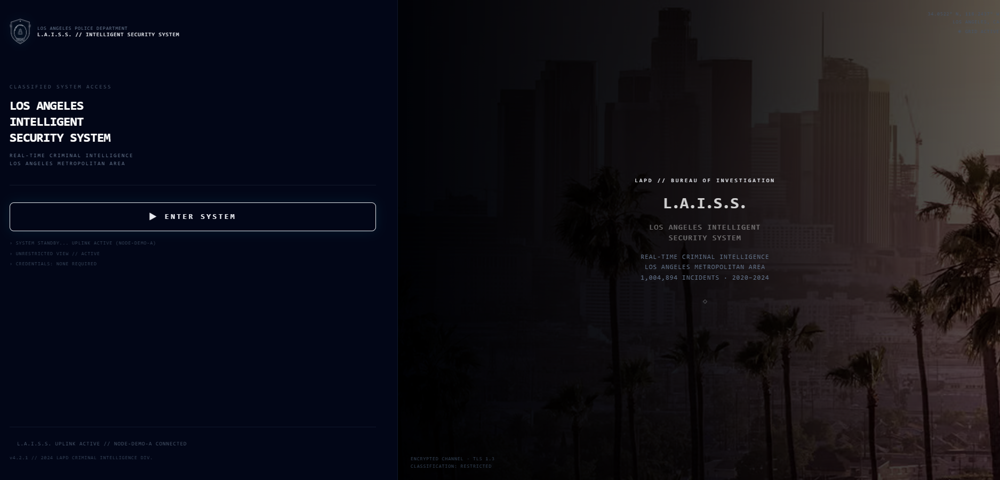

## Project Overview

| Item | Detail |
|---|---|
| **Dataset** | LAPD Crime Data 2020–2024 (data.lacity.org) |
| **Records** | 1,004,894 incidents |
| **Period** | Jan 1, 2020 → Dec 30, 2024 |
| **Geography** | City of Los Angeles — 21 LAPD divisions |

## Deliverables

- **Data pipeline** — cleaning, enrichment (Census, address density, Council District mapping), JSON/GeoJSON export for the web app (`src/`, `scripts/`)
- **Web Dashboard** (`dashboard/`) — Next.js app deployed to Vercel, open access (Supabase login is a demo flow, not gated)
- **Power BI Dashboard** — dark-themed desktop report, star schema exported to CSV (`docs/POWERBI_GUIDE.md`)
- **ML Models** — hotspot prediction (base, temporal, by crime type, by neighborhood) · clearance prediction · time-series forecasting · crime classifier · transit proximity (`src/`, `notebooks/`)

## Dashboard modules (`dashboard/src/app/`)

| Route | Module |
|---|---|
| `/login` | Landing + Supabase auth (guest demo access) |
| `/dashboard` | Main analytics — KPIs, tactical filters (year/month/shift/day type/theft), Arrests chapter |
| `/osiris` | Geo intelligence — 17 switchable map layers: OSINT basemaps (heat, clusters, choropleth, mobility, edu-safety, jurisdictions, crime density), LAPD-specific layers (divisions, LAPD heat, per-1k, vulnerability, neighborhoods, business density), 3 ML hotspot layers (risk, temporal, neighborhood), and a tactical/CIA-style overlay |
| `/insights` | 12-chapter data storytelling: 01 The Scale of the Problem · 02 The Clearance Crisis · 03 The Geography of Crime · 04 What Crimes Are Being Committed · 05 When Crime Strikes · 06 Who Bears the Burden · 07 The Neighborhood Risk Index · 08 Who Gets Arrested · 09 Crime Forecast · 10 Predicting Clearance · 11 Predicting Hotspots · 12 Key Findings |
| `/geo` | Council District / jurisdiction views |
| `/compare` | Side-by-side comparison view |
| `/glossary` | Data dictionary / methodology reference (EN) |
| `/twin` | 3D City Twin module |

## Screenshots

**Dashboard** — KPIs and Arrests chapter

| Overview | Arrests — by division (density-normalized) | Arrests — demographics & charges |
|---|---|---|
| 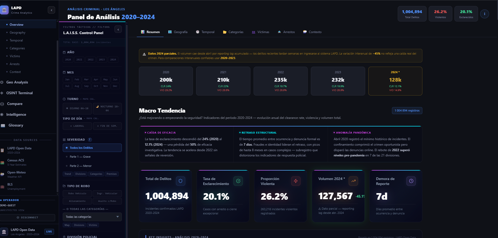 | 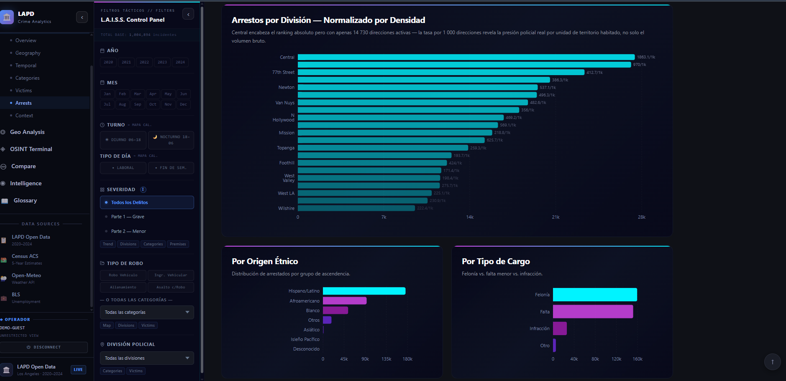 | 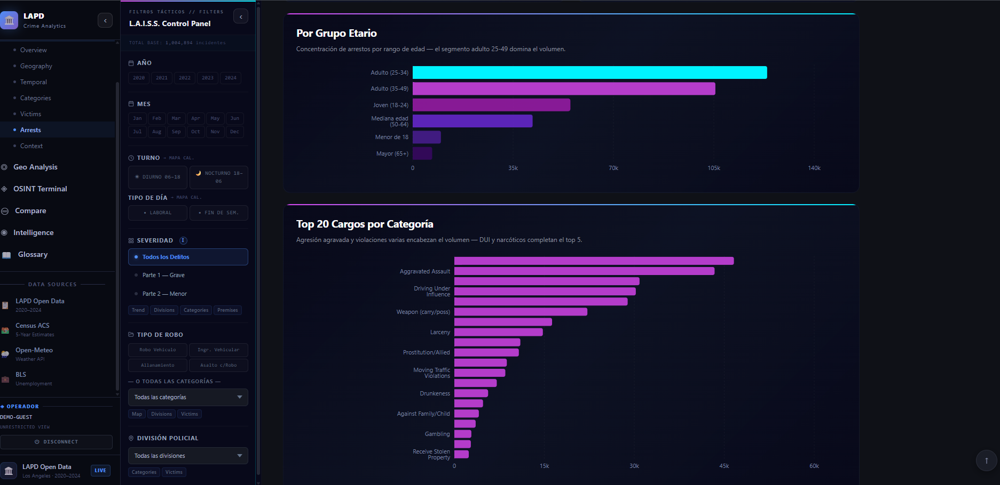 |

**OSIRIS** — geo intelligence, 17 switchable map layers over the same LA basemap

| Tactical / CIA overlay | Choropleth | Cluster |
|---|---|---|
| 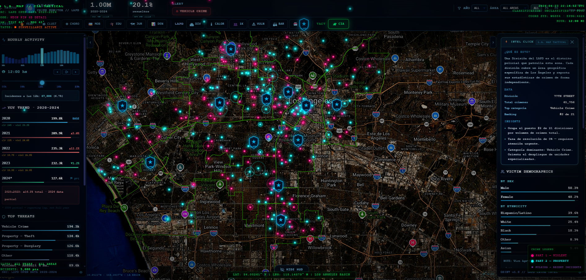 | 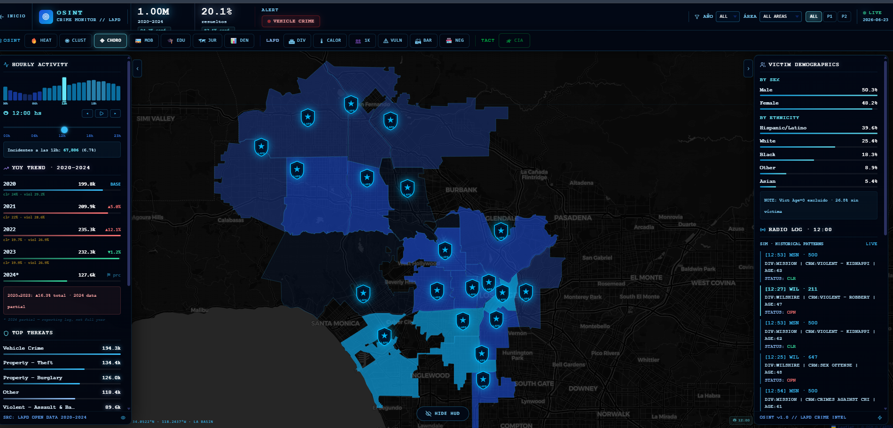 | 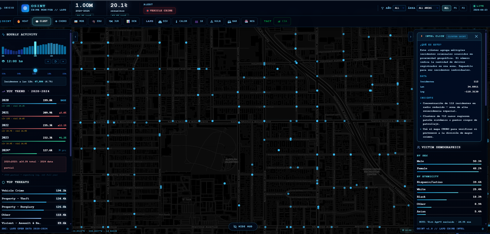 |

| Business density | Neighborhood vulnerability | Mobility corridors |
|---|---|---|
| 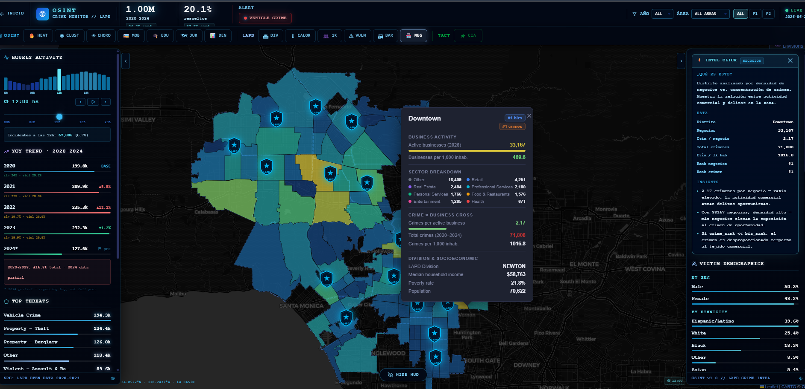 | 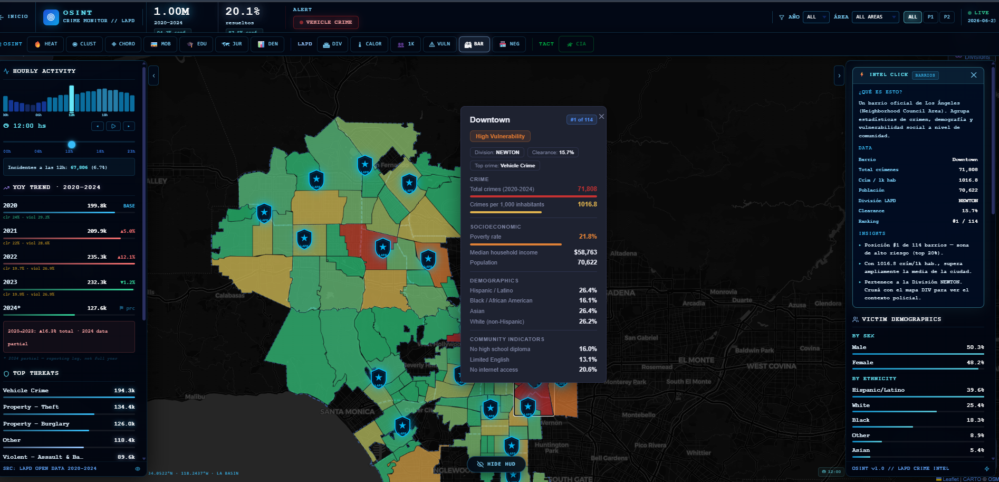 | 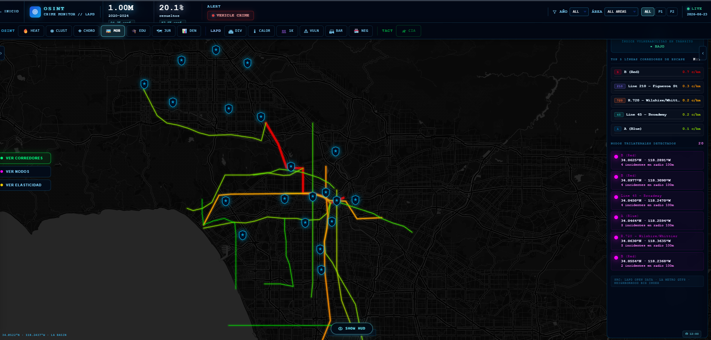 |

| Education safety — detail | Education safety — citywide | Divisions + radio log |
|---|---|---|
| 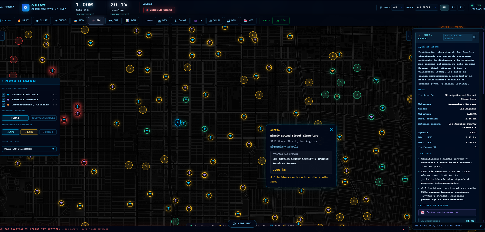 | 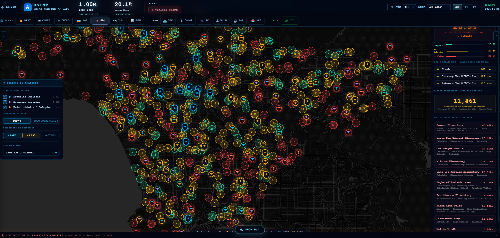 | 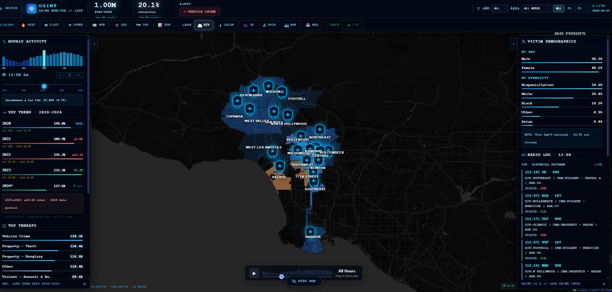 |

**Insights** — data storytelling chapters

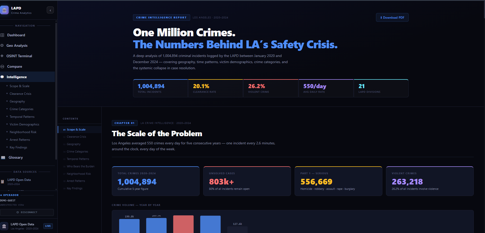

## Repository Structure

```
LAPD-DATA-CRIME/
├── data/
│   ├── external/       ← GeoJSON, Census, external enrichment sources
│   └── processed/      ← Cleaned Parquet (gitignored)
├── datasets/            ← Tracked parquet/csv inputs (addresses, arrests)
├── notebooks/
│   ├── 01_data_preparation.ipynb
│   ├── 02_eda.ipynb
│   ├── 03_external_data.ipynb
│   ├── 04_ml_hotspot.ipynb
│   ├── 05_ml_forecast.ipynb
│   └── 06_ml_classifier.ipynb
├── src/                  ← Numbered pipeline modules, imported by notebooks/ (e.g. `from src.prepare_data import ...`)
├── scripts/              ← Standalone generators, run ad hoc — write straight to dashboard/public/data/, not wired into notebooks/
├── dashboard/            ← Next.js 16 web app (deployed to Vercel)
│   ├── src/app/            ← Routes: login, dashboard, osiris, insights, geo, compare, glossary
│   └── public/data/         ← Static GeoJSON/JSON consumed by the frontend
├── outputs/
│   ├── figures/            ← Saved plots
│   └── reports/            ← EDA HTML reports
└── docs/
    ├── 00_data_dictionary.html
    └── POWERBI_GUIDE.md
```

## Setup

```bash
# Clone repo
git clone https://github.com/licgermancardenas-crypto/LAPD-DATA-CRIME.git
cd LAPD-DATA-CRIME

# Python pipeline
pip install -r requirements.txt
# Add raw data (not in git — download from data.lacity.org)
# Place CSV at: data/raw/Crime_Data_from_2020_to_2024.csv

# Web dashboard
cd dashboard
npm install
npm run dev   # http://localhost:3000
```

Dashboard env vars (Vercel / `.env.local`): `NEXT_PUBLIC_SUPABASE_URL`, `NEXT_PUBLIC_SUPABASE_ANON_KEY`, `NEXT_PUBLIC_GOOGLE_MAPS_API_KEY`. See `dashboard/README.md` for frontend-specific details.

## Data Source

- **LAPD Open Data Portal:** [data.lacity.org](https://data.lacity.org/Public-Safety/Crime-Data-from-2020-to-Present/2nrs-mtv8)
- **Reporting Standard:** FBI Uniform Crime Reporting (UCR)
- **Data license:** City of Los Angeles Open Data

### Enrichment sources (predictive model)

Added 2026-07-12/13 to feed the crime model — disorder proxy, lighting, alcohol outlet density, housing tenure, and land use, all joined to LAPD divisions or Census tracts by name/GEOID (no fuzzy matching or geocoding needed anywhere):

| Source | Script | Output |
|---|---|---|
| [MyLA311 Service Request Data](https://data.lacity.org/City-Infrastructure-Service-Requests/) 2020–2024 (Socrata, `rq3b-xjk8`…`b7dx-7gc3`) — monthly counts by division for bulky items, graffiti, illegal dumping, homeless encampments, dead animals, streetlight outages | `scripts/fetch_311_data.py` | `data/external/311_monthly_by_precinct.csv`, `dashboard/public/data/disorder_monthly.json` |
| [Bureau of Street Lighting](https://maps.lacity.org/lahub/rest/services/Bureau_of_Street_Lighting/MapServer/0) — 222k streetlight points citywide (the Socrata mirror `9ei6-svt8` returns empty records; this hits the ArcGIS FeatureServer directly) | `scripts/fetch_streetlights.py` → `scripts/generate_disorder_streetlight_data.py` | `data/external/streetlights_la.geojson`, `dashboard/public/data/streetlight_density.geojson` |
| [California ABC](https://www.abc.ca.gov/licensing/licensing-reports/) daily license export — 23k active LA County alcohol licenses, off-sale/on-sale split, already tract-tagged (no geocoding needed) | `scripts/fetch_abc_licenses.py` → `scripts/generate_alcohol_zoning_data.py` | `data/external/abc_licenses_by_tract.csv`, `dashboard/public/data/alcohol_density.geojson` |
| [ACS Housing Occupancy & Tenure](https://services.arcgis.com/P3ePLMYs2RVChkJx/arcgis/rest/services/ACS_Housing_Occupancy_and_Tenure_Unit_Value_Boundaries/FeatureServer) (Esri Living Atlas mirror — the Census ACS API itself is unreachable from this environment) — owner-occupancy rate by tract | `scripts/fetch_housing_tenure.py` | `data/external/housing_tenure_la.csv`, merged into `lapd_enriched.parquet`'s `owner_occ_rate` |
| [LA Zoning](https://services5.arcgis.com/7nsPwEMP38bSkCjy/arcgis/rest/services/Zoning/FeatureServer/15) — 58.9k parcels, land-use category mix (Residential/Commercial/Manufacturing/…) per LAPD division via spatial overlay | `scripts/fetch_zoning.py` → `scripts/generate_alcohol_zoning_data.py` | `data/external/zoning_la.geojson` (234 MB, gitignored — regenerate locally), `dashboard/public/data/zoning_by_division.json` |

`policeprecinct` (311) and `area name` (LAPD divisions) match 1:1 by name — no fuzzy join needed.

## Tech Stack

| Layer | Tools |
|---|---|
| Data prep | Python · pandas · geopandas · shapely |
| Visualization | matplotlib · seaborn |
| ML | scikit-learn · xgboost · prophet · statsmodels · shap |
| Dashboard | Next.js 16 · React 19 · Tailwind CSS · Recharts · Google Maps API |
| Auth | Supabase (`@supabase/ssr`) |
| Deploy | Vercel |
| Formats | Parquet · GeoJSON · JSON |

## License

Code: [MIT](LICENSE). Underlying crime data: City of Los Angeles Open Data (see [Data Source](#data-source)).

---

*Data source: Los Angeles Police Department via data.lacity.org*
